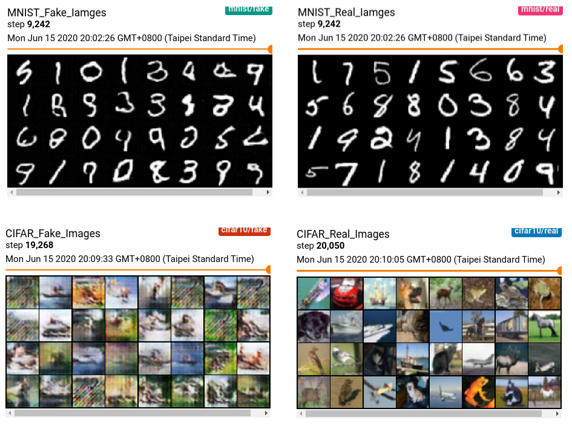

# trytry-dcgan

Have a taste with simple GAN model generating MNIST given a random noise.

## Environment Setting
```bash
$ pip install -r requirements.txt

# Or type this command
$ pip install torch torchvision tensorboardx tensorflow pyyaml
```

## Convolution v.s Transposed Convolution
The difference between convolutional layer and transposed convolutional layer is that...
- convolutional layer is for downsampling input and extract useful feature,
- transposed convolutional layer is for upsampling feature embedding and reconstruct something from latent feature.

The output dimension (height/width) after convolutional layer:
$$
    output_size = \frac{input_size + 2*padding_size - filter_size}{stride} + 1
$$
The output dimension (height/width) after transposed convolutional layer:
$$
    output_size = stride*(input_size-1) + filter_size - 2*padding_size
$$

## How to train GAN stably
- Replace any pooling layers with strided convolutions (discriminator) and fractional-strided convolutions (generator)
- Use batchnorm in both the generator and the discriminator
- Remove fully connected layers for deeper architectures
- Use ReLU activation in generator for all layers except for the output, which uses Tanh.
- Use LeakyReLU activation in the discriminator for all layers

## Development Tips
- Using YAML file to define the configuration options
- Define models with explicit layers rather than dynamically generating them if possible
- Seperate the program logic by defined appropriate function directory...
- Check input dimension in forward method in each model with assert instruction

## Train MNIST DCGAN model
```bash
$ python main.py --config config/example_mnist.yml
```

## Check tensorboard
```bash
$ tensorboard --logdir="run" --host=0.0.0.0 --port=6006
```

